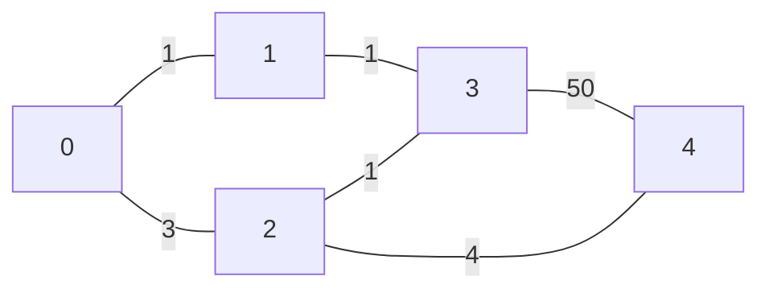

# mpc_graph_theory_lib (an`SCALE-MAMBA` implementation for Basic Graph Theory)

\
This repository includes (currently we only recommend experimentation):

* Basic random sampling using `Dijkstra` with cubic complexity from Aly et al.
* Improved `Dijkstra` with cuadratic complexity from Aly and Cleemput.
* Will include complete test files.

## Pre-requisites

* Docker

## Installation and Configuration

It is preferred to run this project using Docker.
To build an image, run `docker build -t mpc-graph-theory .`.
To run this image, run `docker run --rm -it mpc-graph-theory sh run_graphs.sh`.

## Example Graph

Currently, the following Graph is encoded in Input-P1-0:

## Contact Information:
If you have questions please contact any of the authors. Current repo maintainer is:\
Abdelrahaman ALY
  * [TII](mailto:abdelrahaman.aly@tii.ae) 
  * [Personal](mailto:abdelrahaman.aly@gmail.ae) 
 

## License
### Authors: 
* Abdelrahaman ALY

Copyright (c) 2022 Technology Innovation Institute - Cryptography Research Centre.\
Licensed under the MIT license.

